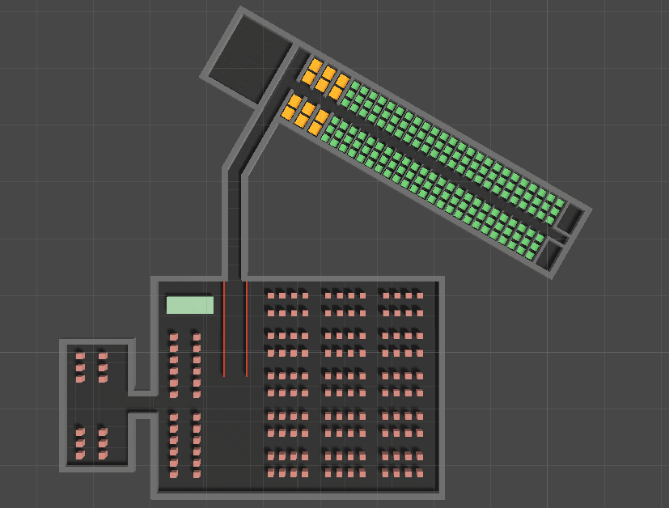
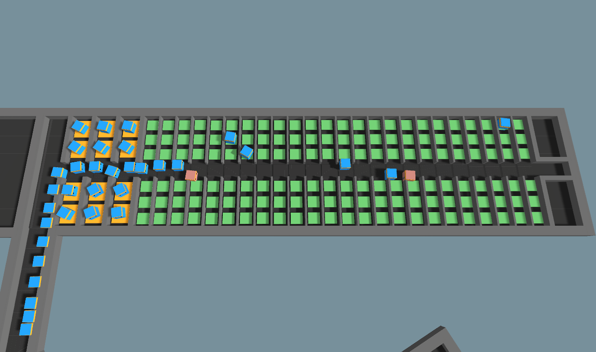

# Multi-Agent Aircraft Boarding Simulation

Unity simulation of multiple airplane boarding methods.

Controllable parameters include:

* Plane boarding method (Random, Front-to-Back, Back-to-Front, Window-Middle-Aisle, Steffen's Perfect, and Steffen's Modified).
* Min Stowage Time - Minimum time a passenger will spend stowing their luggage.
* Max Stowage Time - Maximum time a passenger will spend stowing their luggage.
* Num Rows to Board (Only applies to front-to-back and back-to-front) - Chooses how many rows to call up at once.
* Wait Time - How much time to wait between calling each passenger (scaled to the number of passengers).
* Simulation Speed - Time scale to run the simulation (5 is a good speed, set speed to 1 for a true plane boarding experience).
* Number of Trials - How many times to run the selected boarding method.

<table align="center">
<tr>
    <td> Environment </td>
    <td> Queuing </td>
</tr>
<tr>
    <td>  </td>
    <td>  </td>
</tr>
</table>

To run the simulations:

1. Clone this repository with `https://github.com/jsicheng/airplane-boarding-simulation.git`
2. Navigate into the `executable` folder.
3. Open `cmd` and run `plane_boarding.exe` in the command prompt.\
Alternatively, run `plane_boarding.exe` directly (which may require you to run the executable as an administrator).

The times for each boaring method after running 20 trials is presented in the table below:

| Boarding Method       | Mean Time (Seconds)   | Standard Deviation    |
| --------------------- | -------------------   | --------------------- |
| Random                | 1359.852              | 76.562                |
| Front-to-Back         | 2263.430              | 123.521               |
| Back-to-Front         | 2239.238              | 106.137               |
| Window-Middle-Aisle   | 1169.300              | 47.175                |
| Steffen's Perfect     | 927.285               | 29.690                |
| Steffen's Modified    | 1149.634              | 51.879                |

